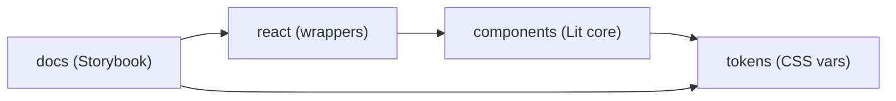

# Architecture Spine — tinkoff-ui-kit

## Design Paradigm

**Core-and-adapters.** A framework-agnostic Lit core owns all rendering, behavior, and tokens;
framework adapters (React first) are generated thin layers; docs sit on the adapter. The core
never imports from adapters; adapters never re-implement behavior. This is the Web Awesome
model, ratified current practice in 2026.



Dependency direction is one-way, left to right at every level. A cycle is an architecture bug.

## Invariants & Rules

### AD-1 — Lit core + generated React package [ADOPTED]

- **Binds:** all components, FR-4
- **Prevents:** dual implementations drifting; second-class web components
- **Rule:** every component is authored once as a Lit custom element in `packages/components`.
  The React package is generated from the Custom Elements Manifest (via
  `@custom-elements-manifest/analyzer`) through `@lit/react` (`createComponent`), one wrapper
  per element, events mapped (`value-change` → `onValueChange`) from an owned, reviewed
  event-map registry in `packages/react`. CI runs `pnpm gen && git diff --exit-code` —
  unregenerated wrappers fail. Handler payloads are uniform: React handlers receive the
  unwrapped `value`, not raw `CustomEvent`. No behavior, styling, or a11y logic lives in
  `packages/react`.

### AD-2 — Shadow DOM; theming via CSS custom properties only [ADOPTED]

- **Binds:** all components, FR-2
- **Prevents:** host-page style bleed; token bypasses that break dark mode
- **Rule:** components render in shadow roots. Cross-boundary theming happens exclusively
  through CSS custom properties defined by the tokens package. Components never read global
  CSS classes, never inject document-level styles, and never hard-code color/radius/shadow/
  font/z-index values (enforced by review checklist + detector). Z-order comes only from the
  z-scale tokens (AD-3).

### AD-3 — Single token pipeline

- **Binds:** FR-1, FR-2, all components
- **Prevents:** token drift between DESIGN.md, code, and docs
- **Rule:** the DESIGN.md spine (frontmatter tokens AND body rules — AA overrides, radius
  registers, dark-mode tonal rules) is normative. The tokens package generates: (a) CSS custom
  properties on `:root` (light) and `[data-theme="dark"]` (dark) layers — every kit-emitted
  property namespaced `--tk-*` (site-native names mirrored after the prefix:
  `--tk-color-primary`, `--tk-shadow-modal`), plus a z-scale (`--tk-z-nav/dropdown/popover/
  tooltip/modal/toast`) and the motion tokens; (b) TS types for programmatic access. Theme
  switch = attribute change on `<html>`; no component markup changes.

### AD-4 — Multi-package workspace, one-way dependencies [ADOPTED]

- **Binds:** repo structure, publishing, FR-11
- **Prevents:** tangled builds; accidental core→adapter imports
- **Rule:** pnpm workspaces, four packages: `tokens`, `components`, `react`, `docs`
  (directories; publish names are OQ-3). Allowed imports: `components→tokens`,
  `react→components`, `docs→{react, components, tokens}` (docs composes the per-component
  stories that live inside `components`). Anything else fails lint.

### AD-5 — Uniform component API convention

- **Binds:** FR-3, all components
- **Prevents:** per-component prop/event naming drift
- **Rule:** properties are camelCase Lit reactive props; events are dispatched as
  `<prop>-change` for value updates and `<verb>` (bare) for occurrences; every stateful component
  ships controlled (`value` + event) and uncontrolled (internal state) modes with identical
  semantics. Documented once in `packages/components/CONVENTIONS.md`; enforced by PR checklist.
  The React-surface API shape (hook vs prop style, controlled-mode semantics) is frozen at the
  **first stateful component PR (Input)** — not at a stateless component — and the overlay API
  (Modal/Toast) is decided in that same PR; later components conform.

### AD-6 — TypeScript strict, ESM-only, Vite library mode

- **Binds:** build, all packages
- **Prevents:** mixed module formats; type drift between core and adapters
- **Rule:** TypeScript 7 `strict` everywhere; ESM-only output; each package builds with
  Vite 8 lib mode, deps externalized; `.d.ts` generated from source. No CommonJS artifacts.
  Node `>= 20` engines across all packages (PRD §5.1).

### AD-7 — Quality gates in the dev loop and CI [ADOPTED]

- **Binds:** FR-6, FR-8, FR-9
- **Prevents:** merging components that fail design/a11y/docs floors
- **Rule:** every component change passes: impeccable detector (edit-time hooks now; CI step
  added at scaffold) with zero blocker findings; `@axe-core/playwright` a11y checks on every
  story (both themes); Storybook story with default + all variants + theming demo + a11y notes.
  A component without stories does not merge.

### AD-8 — Visual fidelity regression [ADOPTED]

- **Binds:** FR-10, SM-3, OQ-6 (resolved)
- **Prevents:** silent visual drift from the reference and between releases
- **Rule:** Playwright screenshot tests (`toHaveScreenshot`, `maxDiffPixelRatio: 0.015`) render
  each component story against **first-approved kit renders** stored as baselines — automated
  comparison is always kit-vs-kit (site captures can't be pixel-diffed: the brand font is not
  bundled, OQ-2). Reference fidelity is a **human gate at baseline creation**: the 16
  reference-grounded components get their baseline PR only with a side-by-side against the
  tbank.ru capture attached; the 3 derived overlays baseline against their first approved
  render (pattern-consistency). Intentional change = explicit baseline re-approval in the same
  PR. Capture environment is pinned: fixed viewport + device-scale-factor, reduced-motion
  forced on, pinned test font, single baselines root — thresholds are incomparable otherwise.

### AD-9 — Motion from tokens only

- **Binds:** FR-7, all interactive components
- **Prevents:** per-component animation values; reduced-motion gaps
- **Rule:** durations and curves come exclusively from motion tokens (AD-3). transitions.dev
  recipes (added at scaffold via `npx transitions-dev add --free`) are **adapted for shadow
  roots**: their `_root.css` `:root`/`html[data-theme]` selectors never match inside a shadow
  stylesheet — motion values fold into the tokens package and the recipes consume
  `--tk-*` custom properties; dark overrides re-express as inherited custom properties. Mapping:
  overlay open/close → productive entrance/exit, tab/content swaps → expressive standard,
  hover → duration-fast (150ms), press → duration-fastest (75ms). Every animation has a
  `prefers-reduced-motion: reduce` path (duration 0, opacity-only fallback).

### AD-10 — SSR deferred [ADOPTED]

- **Binds:** OQ-7
- **Prevents:** paying SSR complexity before a consumer needs it
- **Rule:** v1 ships client-rendered components. Revisit when the first SSR consumer appears;
  the known path is Declarative Shadow DOM (`@lit-labs/ssr` state: experimental — verified
  2026-09). Nothing in the core may block that future (no imperative DOM access at construction
  time; render via Lit templates only).

### AD-11 — Behavioral contract authority

- **Binds:** FR-5, all components
- **Prevents:** divergent overlay/focus/responsive semantics between components
- **Rule:** EXPERIENCE.md is normative in full — Component Patterns, State Patterns,
  Interaction Primitives (focus-ring spec, timings), Accessibility Floor, and Responsive &
  Platform (breakpoints, <768px burger drawer, touch parity). Where EXPERIENCE.md and
  implementation disagree, the implementation is wrong until either changes by PR.

### AD-12 — Overlay mechanics: single owner

- **Binds:** Modal, Tooltip, Toast, Select menu, Navbar drawer
- **Prevents:** z-index arms races, double scroll-locks, duplicated positioning logic
- **Rule:** z-order comes only from the `--tk-z-*` scale (AD-3). A shared overlay controller
  in `packages/components` owns: mounting (top-layer with fallback), refcounted body
  scroll-lock (Modal, Navbar drawer), viewport-flip positioning (Tooltip, Select menu), and
  cross-instance Toast stacking (bottom-right, max 3). Every floating surface uses the
  controller; none implements its own z-index or scroll-lock.

## Consistency Conventions

| Concern | Convention |
| --- | --- |
| Custom element names | `tk-` prefix, kebab-case (`tk-button`, `tk-segmented-radio`); prefix revisited with OQ-3 |
| Files | one component per directory under `packages/components/src/<name>/` (index, styles, tests, story) |
| Events | `<prop>-change` (value updates), `<verb>` bare (occurrences); payload `detail: { value }` |
| Theming | only CSS custom properties cross shadow boundaries; all kit tokens `--tk-*`-namespaced |
| Per-component custom properties | grammar `--tk-<component>-<slot>` (e.g. `--tk-input-fill` = `--tk-select-fill` for shared slots — same slot name for the same role across components) |
| Dark mode | `[data-theme="dark"]` on `<html>`; tokens layer swaps; components stay markup-identical |
| Fonts | `--tk-font-*` slots with system fallbacks; brand font supplied by consumer (OQ-2; Inter default rec); never bundled |
| Errors/announcements | aria-live regions over visual-only errors; toasts polite, destructive role=alert |
| Publishing | MIT; semver; changelog per release; unofficial disclaimer in every published artifact (README, docs, repo) — FR-11 |

## Stack

| Name | Version |
| --- | --- |
| TypeScript | 7.0.2 (strict) |
| Lit | 3.3.3 |
| @lit/react | 1.0.8 |
| React (peer) | 19.3.0 |
| Vite | 8.3.0 (lib mode) |
| Storybook | 10.6.0 (`@storybook/web-components-vite`, `addon-a11y`) |
| pnpm | 12.5.1 (workspaces) |
| Vitest | 5.0.1 |
| Playwright | 1.63.0 (+ `@axe-core/playwright` 4.13.0) |
| @custom-elements-manifest/analyzer | 0.11.0 |
| impeccable detector | engine at `.claude/skills/impeccable/` |

All versions web-verified 2026-09-21 (registry dist-tags). Stack is seed: once code exists,
lockfiles own the truth.

## Structural Seed

```text
{root}/
  packages/
    tokens/        # source of truth generation: CSS vars (light+dark), TS types
    components/    # Lit core: src/<component>/ (element, styles, test, story)
      CONVENTIONS.md
    react/         # @lit/react wrappers, generated from CEM + manual event maps
    docs/          # Storybook 10: stories re-export components' stories, theming addon
  .playwright-cli/ # reference captures (baselines)
  _bmad-output/    # planning artifacts (this spine's sources)
```

## Capability → Architecture Map

| Capability / Area | Lives in | Governed by |
| --- | --- | --- |
| FR-1 token extraction | `tokens` | AD-3, AD-2 |
| FR-2 theming/dark | `tokens` + component styles | AD-2, AD-3 |
| FR-3 API consistency | `components/CONVENTIONS.md` + `react` | AD-5, AD-1 |
| FR-4 19 components | `components/src/*` | AD-1, AD-2, AD-11 |
| FR-5 overlay behaviors | Modal/Tooltip/Toast in `components` + overlay controller | AD-11, AD-12 |
| FR-6 WCAG AA | stories + axe tests | AD-7 |
| FR-7 motion | component styles + `t-*` recipes | AD-9 |
| FR-8 story docs | `docs` (Storybook) | AD-7 |
| FR-9 design gate | hooks + CI step | AD-7 |
| FR-10 fidelity | playwright visual tests | AD-8 |
| FR-11 distribution | `react`/`components`/`tokens` publish | AD-4, OQ-3 deferred |

## Deferred

- **SSR pipeline** — client-only in v1; revisit at first SSR consumer (AD-10).
- ~~Publish names + element prefix final call (OQ-3)~~ — RESOLVED (2026-09-22): `pillkit-*` +
  `tk-`/`--tk-*` permanent; distribution amended 2026-09-23 to GitHub git-tags only (no npm).
- ~~CI provider & pipeline shape~~ — RESOLVED: GitHub Actions, live since Story 1.8.
- **Dark tint refinement** — `dark-tint-*` first-pass values refined at build with fidelity
  checks (per DESIGN.md). *(v1 tints verified at 5.4; v2 warm-cream dark first-pass carries
  the same revisit.)*
- **i18n story** — copy is localization-ready (string slots); v1 ships one language (OQ-4).

## v2 Delta (2026-09-24 — multi-domain expansion; no architectural change)

The v2 scope (PRD §4.8, FR-12..16 — business + two invest domains) rides the frozen substrate.
Every AD re-checked and holding: new components are Lit shadow elements consuming `--tk-*`
(AD-1/2/3); the combobox search reuses the dropdown overlay layer — nothing adds z-layers
(AD-12); DataTable's roving-tabindex keyboard is an interaction pattern within AD-5's frozen
conventions (v2 rows are links — NO selection channel; a future selection column reopens §4);
typography registers are mappings onto existing tokens, not branches (AD-3); v2 fidelity
baselines = the v2 capture pack through the existing harness (AD-8, provisional rule
unchanged); FR-16's gate is the component-story gate verbatim (AD-7). No spine invariants
move; this section is the delta record (full reasoning in the run memlog, 2026-09-24).
